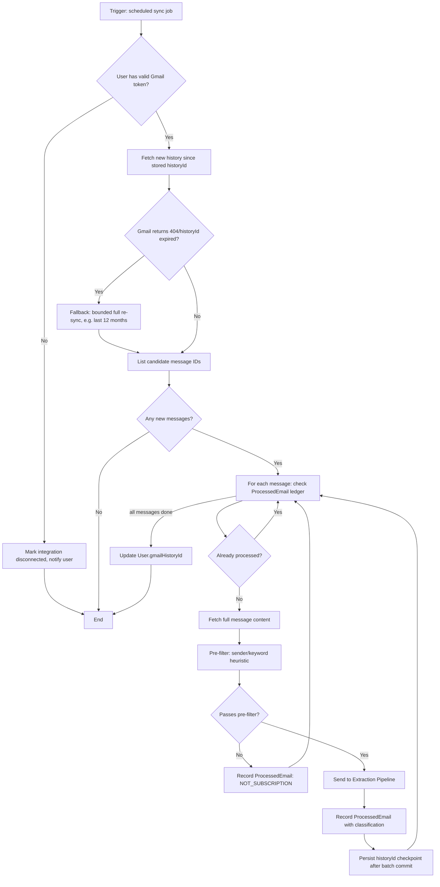
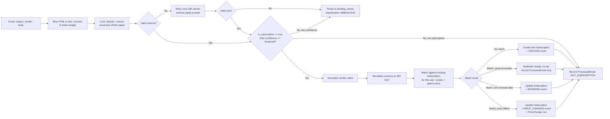
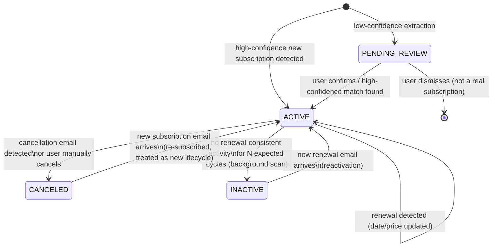

# Subscription Tracking Agent — Technical Design

*Phase 2 output, per [subscription-tracking-agent-prompts.md](../subscription-tracking-agent-prompts.md). Builds on the approved architecture in [docs/architecture.md](architecture.md).*

---

## 1. Database Schema (Prisma)

```prisma
enum SubscriptionStatus {
  ACTIVE
  CANCELED
  INACTIVE
  PENDING_REVIEW
}

enum BillingCycle {
  WEEKLY
  MONTHLY
  ANNUAL
  CUSTOM
}

enum EventType {
  CREATED
  RENEWED
  PRICE_CHANGED
  CANCELED
  FLAGGED_INACTIVE
  REACTIVATED
}

enum EmailClassification {
  SUBSCRIPTION
  NOT_SUBSCRIPTION
  AMBIGUOUS
}

model User {
  id                String         @id @default(cuid())
  email             String         @unique
  gmailRefreshToken String?        // encrypted at the application layer before storage
  gmailHistoryId    String?        // Gmail sync checkpoint
  gmailConnected    Boolean        @default(false)
  createdAt         DateTime       @default(now())
  updatedAt         DateTime       @updatedAt

  subscriptions     Subscription[]
  processedEmails   ProcessedEmail[]
  auditLogs         AuditLog[]
}

model Subscription {
  id                 String             @id @default(cuid())
  userId             String
  user               User               @relation(fields: [userId], references: [id])

  vendorNormalized   String
  vendorRaw          String
  status             SubscriptionStatus @default(ACTIVE)

  priceAmountCents   Int
  priceCurrency      String             // ISO 4217
  billingCycle       BillingCycle

  nextRenewalDate    DateTime?
  lastSeenEmailId    String?
  confidenceScore    Float

  createdAt          DateTime           @default(now())
  updatedAt          DateTime           @updatedAt

  events             SubscriptionEvent[]
  priceChanges       PriceChange[]

  @@index([userId, status])
  @@index([userId, vendorNormalized])
  @@index([userId, nextRenewalDate])
}

model SubscriptionEvent {
  id             String       @id @default(cuid())
  subscriptionId String
  subscription   Subscription @relation(fields: [subscriptionId], references: [id])

  eventType      EventType
  sourceEmailId  String?
  payload        Json         // extraction snapshot at time of event

  createdAt      DateTime     @default(now())

  @@index([subscriptionId, createdAt])
}

model PriceChange {
  id             String       @id @default(cuid())
  subscriptionId String
  subscription   Subscription @relation(fields: [subscriptionId], references: [id])

  oldAmountCents Int
  newAmountCents Int
  currency       String

  detectedAt     DateTime     @default(now())
  sourceEmailId  String?

  @@index([subscriptionId, detectedAt])
}

model ProcessedEmail {
  id               String               @id @default(cuid())
  userId           String
  user             User                 @relation(fields: [userId], references: [id])

  gmailMessageId   String
  gmailHistoryId   String
  classification   EmailClassification
  processedAt      DateTime             @default(now())

  @@unique([userId, gmailMessageId])
  @@index([userId, processedAt])
}

model AuditLog {
  id        String   @id @default(cuid())
  userId    String
  user      User     @relation(fields: [userId], references: [id])

  action    String
  actor     String   // "system" | "user"
  details   Json

  createdAt DateTime @default(now())

  @@index([userId, createdAt])
}
```

Notes:
- Money stored as `Int` cents (`priceAmountCents`) — never `Float`.
- `ProcessedEmail` has a compound unique constraint `(userId, gmailMessageId)`, which is the hard idempotency guarantee referenced in the architecture doc.
- `SubscriptionEvent.payload` retains the raw extraction result for that event so history is reconstructable without re-deriving from email.

---

## 2. Gmail Processing Workflow



Key properties:
- The `historyId` checkpoint is only advanced **after** a batch of messages successfully commits — a crash mid-batch resumes from the last committed checkpoint rather than reprocessing everything or silently skipping messages.
- Rate-limit (429) handling wraps every Gmail API call (`C`, `E`, `I`) with exponential backoff + jitter, respecting `Retry-After`; not drawn per-node to keep the diagram readable.

---

## 3. Subscription Extraction Pipeline



Extraction output schema (LLM-facing contract):

```json
{
  "is_subscription": true,
  "vendor": "Netflix",
  "price": { "amount": 15.49, "currency": "USD" },
  "billing_cycle": "monthly",
  "renewal_date": "2026-10-02",
  "confidence": 0.94
}
```

Validation rules applied after the LLM call (deterministic, not LLM-trusted):
- `confidence` must be a float in `[0, 1]`; anything outside range is treated as `0` (forces review).
- `price.amount` must be a positive number; `currency` must be a valid ISO 4217 code, else routed to review.
- `renewal_date`, if present, must parse as a valid future-or-recent date; implausible dates (e.g., >5 years out) are flagged, not trusted.
- The email body is passed to the LLM strictly as a data field inside a fixed prompt template — the model is never given tool/action capability, so even a successful injection can at most corrupt the JSON output (which validation then catches or routes to review), not trigger a side effect.

---

## 4. State Machine — Subscription Lifecycle



Transition rules:
- `PENDING_REVIEW` is only ever entered from a fresh extraction below the confidence threshold — it never overwrites an existing `ACTIVE` subscription's state without explicit resolution.
- `ACTIVE → INACTIVE` is driven by the Alert Scheduler (Section 5), not the extraction pipeline — it's a time-based background judgment, not an email-triggered one.
- `CANCELED → ACTIVE` is modeled as a fresh lifecycle (new `SubscriptionEvent: CREATED`) rather than a `REACTIVATED` event on the old record, since a cancel-then-resubscribe often carries a new price/plan.

---

## 5. Alert Scheduling Mechanism

```mermaid
flowchart TD
    subgraph Recurring Jobs
        A[Renewal Reminder Job\nruns daily] --> A1[Query subscriptions where\nnextRenewalDate in [now, now+7d]\nand status=ACTIVE]
        A1 --> A2[Emit notification per subscription\nidempotent: one per renewal cycle]

        B[Price Increase Job] --> B1[Triggered inline by extraction pipeline\non PRICE_CHANGED event, not polled]
        B1 --> B2[Emit notification immediately]

        C[Inactivity Scan Job\nruns weekly] --> C1[Query ACTIVE subscriptions where\nnextRenewalDate < now - grace period\nand no renewal event since]
        C1 --> C2[Transition to INACTIVE\n+ emit notification]
    end

    A2 --> D[Notification Feed / API]
    B2 --> D
    C2 --> D
    D --> E[Dashboard + optional email digest]
```

Design notes:
- Renewal reminders and inactivity scans are **polling jobs** (daily/weekly cron) since they're time-based judgments over existing data.
- Price-increase alerts are **event-driven**, fired directly when the extraction pipeline records a `PRICE_CHANGED` event — no need to wait for the next poll.
- All jobs are idempotent per `(subscription_id, alert_type, cycle)` to survive job overlap/retries; combined with the per-user advisory lock from the architecture doc, this prevents duplicate notifications.

---

## 6. Entity Extraction Strategy

- **Single-pass LLM call per email**, combining classification (`is_subscription`) and extraction in one structured-output request — avoids a separate classify-then-extract round trip for the common case, reducing cost per Architecture Review finding #2.
- **Pre-filter before LLM**: a cheap, deterministic heuristic (sender domain patterns, subject/snippet keyword match) eliminates the majority of non-subscription mail before it incurs any LLM cost. This is the primary cost-control lever.
- **Prompt structure**: fixed system prompt + fixed output schema; email content injected only as a clearly delimited data field, never concatenated into instruction text — the concrete mechanism for the prompt-injection concern raised in the architecture review (finding #3).
- **Confidence calibration**: rather than trusting the LLM's self-reported confidence in isolation, confidence is adjusted by deterministic signals (e.g., known-vendor domain match boosts confidence, missing/unparseable price or date caps confidence below the auto-apply threshold). Reduces reliance on an uncalibrated model signal (review finding #9).
- **Vendor normalization strategy**: exact-match lookup table first; fuzzy match (e.g., trigram similarity) only as a fallback, and any fuzzy match below a similarity threshold is routed to `pending_review` rather than auto-merged (review finding #4) — never silently merges two vendors.
- **Currency extraction**: parsed from explicit currency symbols/codes in the email; if absent, defaults to the user's Gmail account locale/country as a heuristic, but is marked low-confidence and eligible for review rather than silently assumed.

---

## Open Items Carried Into Implementation

These map directly to review findings from Phase 1 that this technical design resolves or explicitly defers:

| Review finding | Resolution in this design |
|---|---|
| #2 LLM cost not bounded | Pre-filter before LLM call; single-pass classify+extract |
| #3 Prompt injection needs a concrete mechanism | Fixed prompt template, email content as delimited data only, no tool/action capability given to the model |
| #4 Vendor merge conflict resolution | Fuzzy-match threshold routes to `pending_review` instead of auto-merge |
| #9 Confidence score calibration | Deterministic signal adjustments layered on top of LLM-reported confidence |
| #5 No resolution workflow for `pending_review` | **Resolved in Phase 3** — review queue UI (`/reviews`) plus `GET /api/reviews`, `POST /api/reviews/:id/confirm`, and `POST /api/reviews/:id/dismiss`. Confirm can include field edits; dismiss is a terminal `DISMISSED` status with an append-only `ReviewDecision`. |
| #6 Mixed-currency reporting guard | **Resolved in Phase 3** — `summarizeSpend` and `GET /api/reports/spend` never add amounts across ISO 4217 codes. Mixed-currency users get per-currency totals and `MIXED_CURRENCY_NO_FX`. |
| #7 Retention/deletion policy | **Partially addressed in Phase 3** — `EmailSnapshot.expiresAt` plus a daily purge job, and cascading deletes on user removal. A documented GDPR TTL/right-to-erasure policy is still required before Phase 8. |
